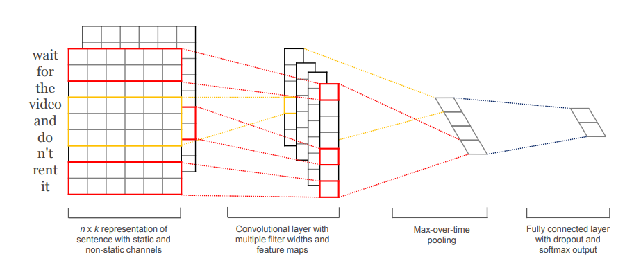
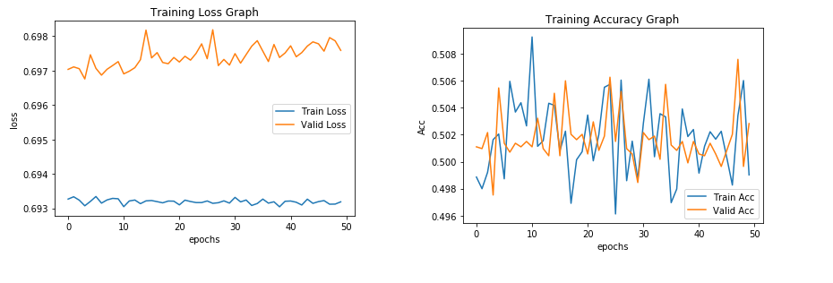
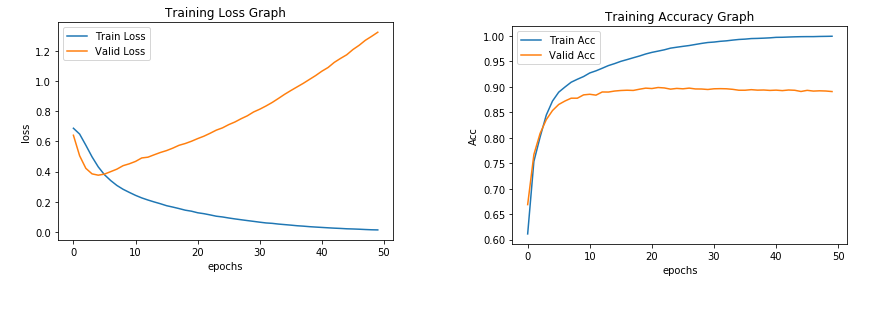
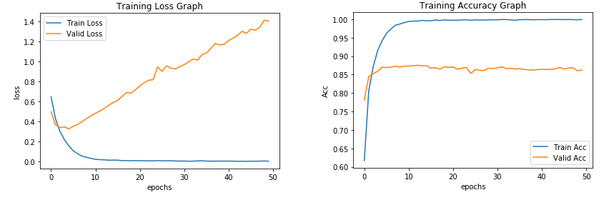
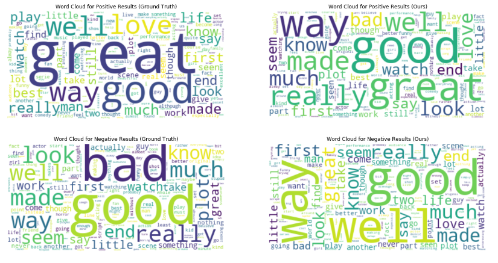
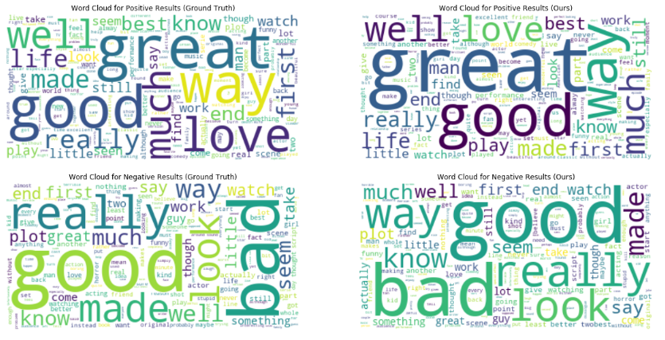
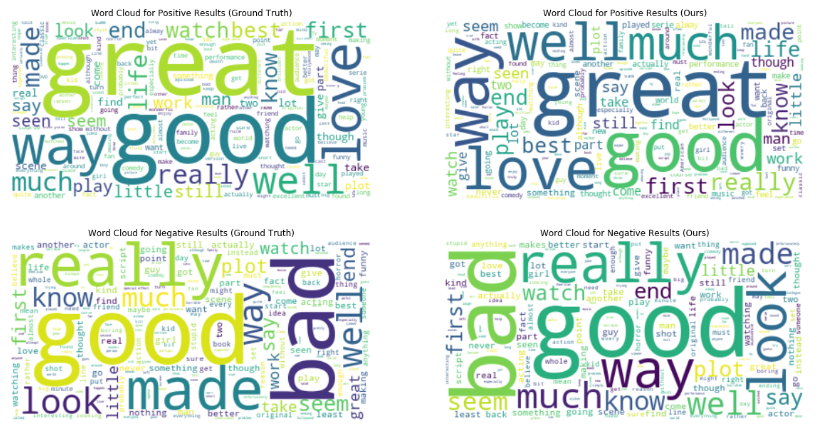
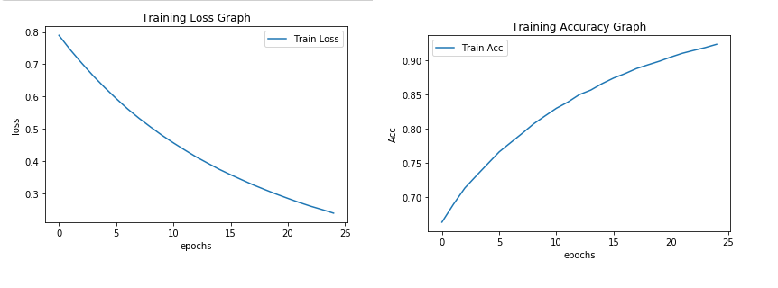

# NLP-Sentiment and Recommendation System (Final Project for EECS-731 Data Science)

Sentiment Analysis using Natural Language Processing

Project Organization
------------

    ├── LICENSE
    ├── README.md                   <- The top-level README for developers using this project.
    ├── data
    │   ├── external                <- Data from third party sources.
    │   ├── interim                 <- Intermediate data that has been transformed.
    │   ├── processed               <- The final, canonical data sets for modeling.
    │   └── raw                     <- The original, immutable data dump.
    │
    ├── notebooks                   <- Jupyter notebooks. Naming convention is a number (for ordering),
    │   └── sentiment_prediction    <- Sentiment prediction
    |
    ├── reports                     <- Generated analysis as HTML, PDF, LaTeX, etc.
    │   └── figures                 <- Generated graphics and figures to be used in reporting

--------

# Project Objective

This project aims at developing following two systems:

1) **binary and multi-class sentiment analysis** and 

2) **Movie Recommendation system**.

This readme first goes through the sentiment analysis part, followed by discussion on recommendation system in the second part.

# Binary and Multi-class Sentiment Analysis System

**Used Datasets**

We have used two datasets for seniment analysis task. 

<ul>
<li>IMDB Reviews dataset with binary sentiment labels (Positive, Negative reviews)</li>
<li>Tweets dataset with 3-way sentiment labels (Pleasant, UnPleasant, Neutral)</li>
</ul>

**DEPLOYED NLP MODELS**

For sentiment analysis modeling, we have employed **three deep NLP** based models, as follows:

<ul>
<li>Recurrent Neural Network (RNN) Based (aka The Baseline)</li>
<li>Bi-grams embedding Based (aka Model1)</li>
<li>Convolutional Neural Network (CNN) Based (aka Model2)</li>
</ul>

Next, we briefly explain these three models and their training and evaluation details.

**1) Recurrent Neural Network (RNN) Based (aka The Baseline)**

This is the first NLP based model for sentiment analysis task. It consists of Recurrent Neural Network (RNN) based nodes with learnable parameters. First, each word is vectorized using a dictionary vector, followed by passing through the 100-D per word embedding layer. Then, we have RNN nodes, outputting hidden state (next layer input). Finally, the last hidden state output passes through the fully connected (FC) layer to yield the sentiment result.

**2) Bi-grams embedding Based (aka Model1)**

This model works similar to the above, except it uses **Global Average Pooling** insted of RNN nodes. Consequently, it works faster and detailed in this paper.

**3) Convolutional Neural Network (CNN) Based (aka Model2)**

This model uses convolutional neural network (CNN) absed approach instead of conventional NLP/RNN method. But still very effective as shown in the evaluation and performance section later.

# NLP Models on IMDB Reviews Binary sentiment dataset

IMDB Reviews dataset is a binary sentiment dataset with two labels (Positive, Negative). Above three NLP models are trained and evaluated on IMDB Reviews dataset separately. Following graphs show their training loss and training accuracy graphs first one by one.

Their evaluation details are as follows:

**As shown above, the baseline is not doing very good in training and testing phases. Model1 and Model2 shine with good accuracy and other evaluation metrics. The code and other details for these three models are given separately in three notebooks in the /notebooks/sentiment_prediction/Reviews_Dataset directory.**

# IMDB Reviews dataset Automated WordCloud Generation using NLP Models

Once we have the models trained and evaluated, here, we analyze and compare the **word cloud** for both sentiments (Positive, Negative) with the ground truth word cloud for both sentiments. Each two rows below shows the comparison of **ground truth word cloud and our three NLP models** respectively.

**1) Recurrent Neural Network (RNN) Based (aka The Baseline)**

**2) Bi-grams embedding Based (aka Model1)**

**3) Convolutional Neural Network (CNN) Based (aka Model2)**

# NLP Models on Tweets Multi-class sentiment dataset

Tweets dataset is a **multi-class (3-way) sentiment tweets dataset** with 3 labels (Pleasant, UnPleasant, Neutral). **Since the Model1 gave one of the best results, so to avoid redundancy, we only trained and evaluated Model1 on Tweets dataset.** Following graphs show the Model1 training loss and training accuracy graphs first on Tweets dataset.

**Model1 again gives reasonable acurracy, precision, and recall values of 92.51%, 0.93 and 0.93 respectively. The code and other details for this Model1 are given in the notebook in the /notebooks/sentiment_prediction/Tweets_Dataset directory.**

